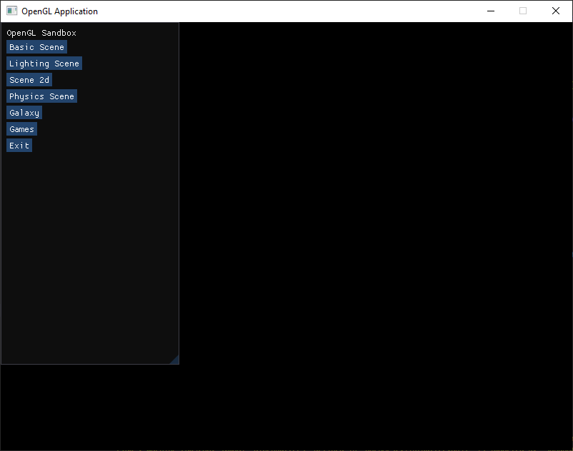
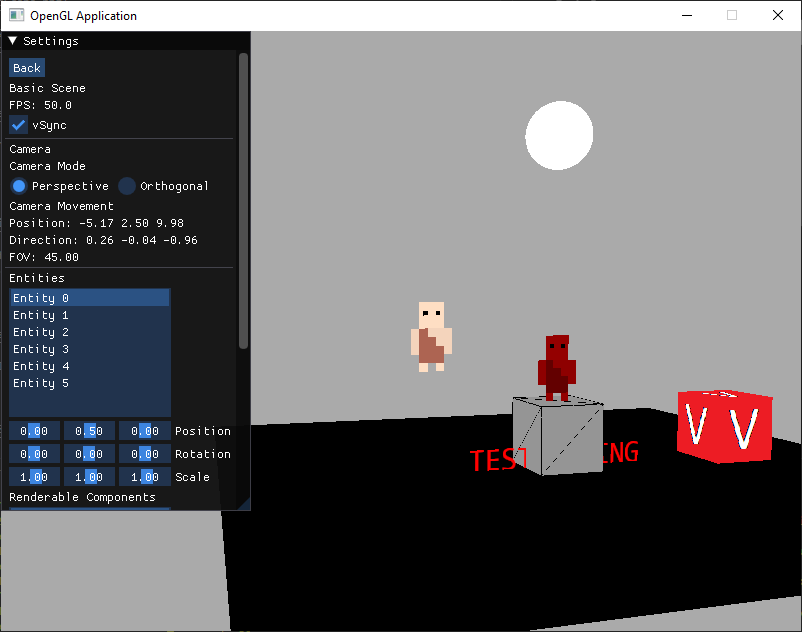
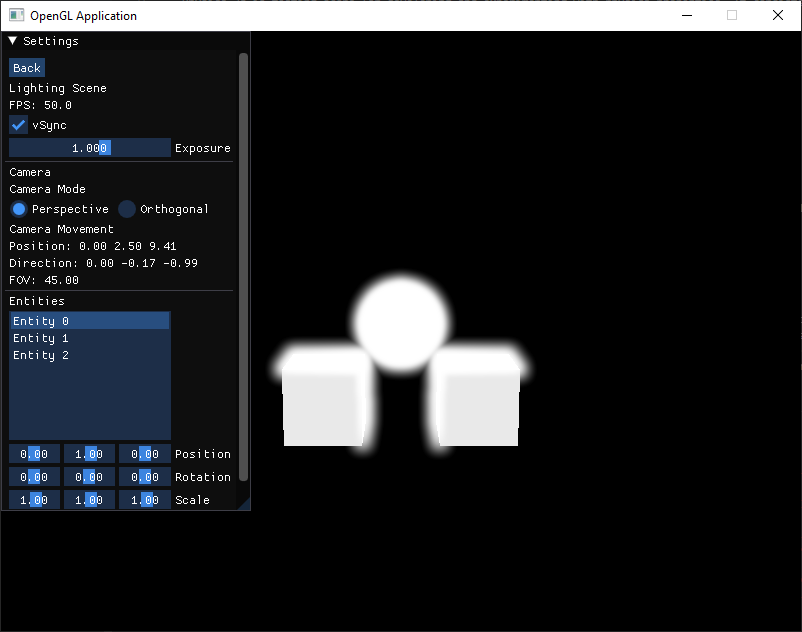
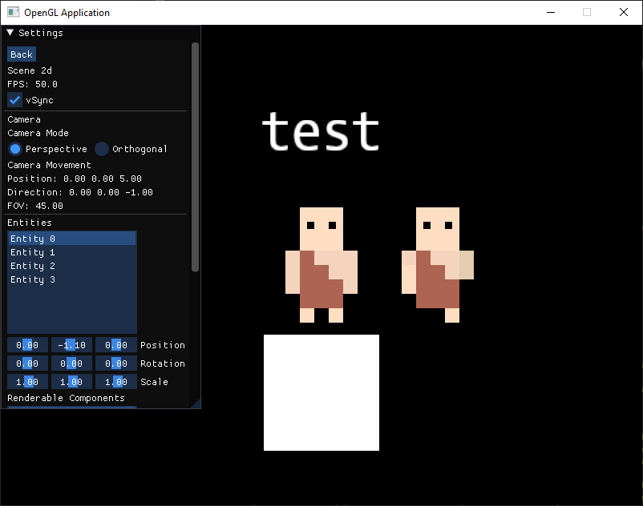
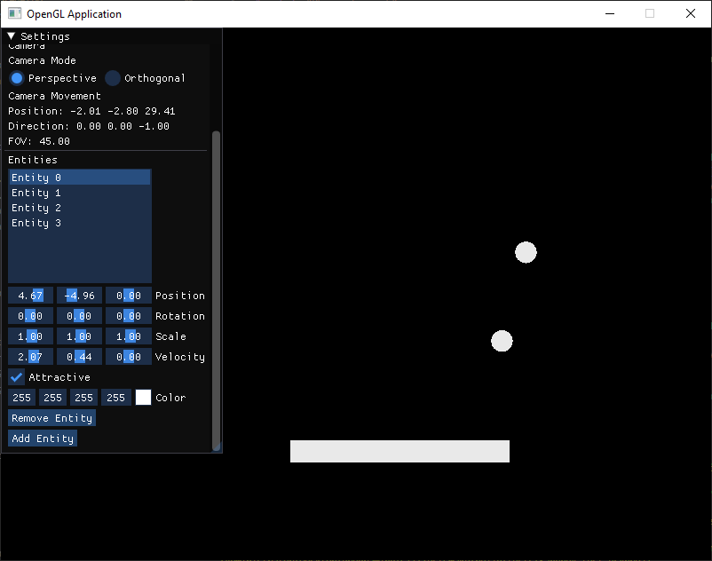
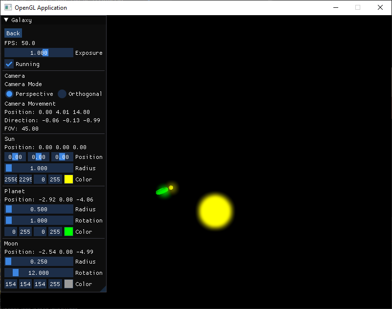
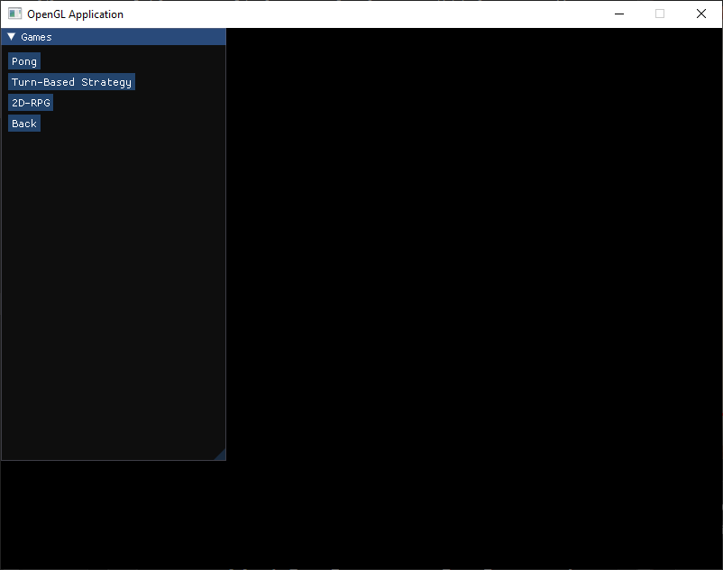
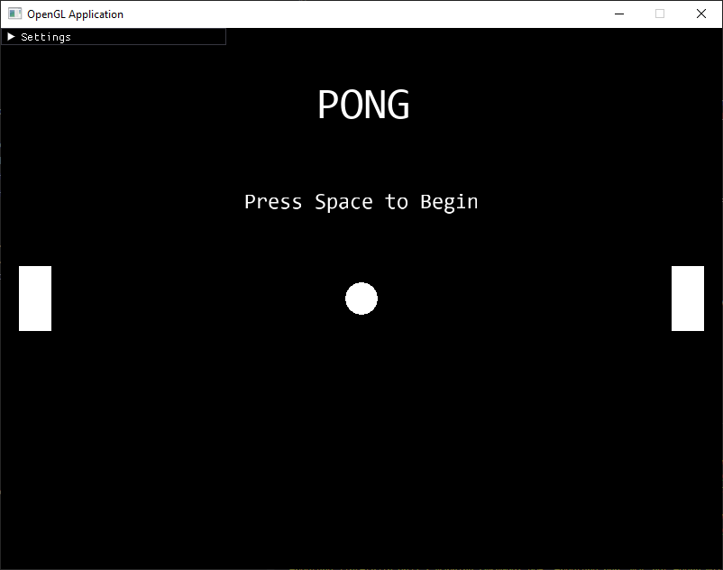
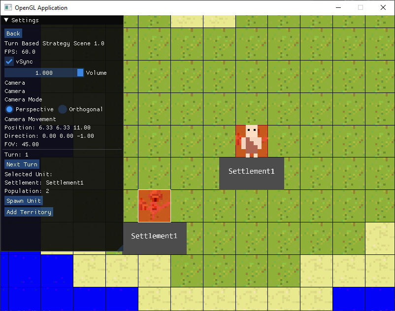

Demo of Clay using "Clay Engine" library from https://github.com/VadimEngine/ClayEngine

# Instructions
## Build and Verify the Clay Static Library
- `git submodule update --init --recursive`
- `cd ./ThirdParty/Clay`
- `./build-tool.sh -Build all`
- `cmake -S . -B build -DBUILD_TESTS=ON`
- `cmake --build ./build/`

Verify the library build by running its unit test:
- `./build/test/Debug/ClayEngineTest.exe`

Alternately, the prebuilt binary and header files can be downloaded from the releases https://github.com/VadimEngine/ClayEngine/releases. If `./ThirdParty/clay` is replaced with the unzipped content, the project can be built without the need to handle the submodules.

## Build and Run Demo Application
- To build (outputs to `/build` directory):
    - `cmake -S . -B build`
    - `cmake --build ./build/`
- To run:
    - `./build/Debug/ClayEngineDemo.exe`

## ScreenShots:

### Menu Page

- Menu page allows selecting a scene and exiting the page.

### Basic Scene

- Basic Scene is pre-set with 2 Entities with renderable components. The Entities and their renderable components can be recolored, moved, rotated and scaled.

### Lightning Scene

- A scene to experiment with OpenGL lighting. Supports multiple light sources and objects to reflect the light off

### Scene 2d

- Scene 2d is testing scene for making a 2d application. It consists of sprites that can be recolored, moved, rotated and scaled.

### Physics Scene

- Physics 2d is testing scene for developing and experimenting with physics properties. It consists of 2d entities that can collide with each other.

### Galaxy Scene

- A simple simulation of a planet and moon orbiting a sun.

### Games Scene

- Games Scene is a scene to hold that multiple mini-games that are made using this engine

### Pong Scene

- Pong Scene is a mini game that consists of 2 paddles and a ball. Scoring is tracked when the ball hits the other sides and the game can be replayed.

### Turn Based Strategy Game Scene

- Turn Based Strategy Game Scene is a small game inspired by Sid Meier's Civilization. The camera can be moved with WASD and zoomed in and out with the mouse wheel. Currently the game only has Settlements and Units. Settlements grow each turn and can produce Units if they have enough population and can buy more tiles if they have enough size. Units can move to tiles other than water with each move taking up moves and can also settle to make a new settlement

